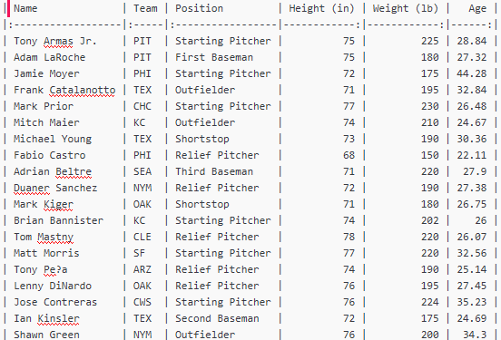

# TabNav - Keyboard Navigation of Tabular Data

TabNav is a Sublime Text 3 plugin for keyboard navigation of tabular text data. Quickly move and select "cells" of text in the following formats, without taking your hands off the keyboard:

* CSV files
* Markdown pipe tables

TabNav also provides the ability to copy only the contents of the table, excluding markup, in a format that can be readily-pasted into other programs, such as Excel.



## Table of Contents

<!-- MarkdownTOC -->

- [Commands](#commands)
  - [Table Navigation Commands](#table-navigation-commands)
  - [Other Commands](#other-commands)
- [Contexts](#contexts)
  - [Markdown](#markdown)
  - [CSV](#csv)
- [Customization](#customization)
  - [Key Bindings](#key-bindings)
  - [Configuration Options](#configuration-options)
  - [Context Configuration](#context-configuration)
    - [CSV Context Configuration](#csv-context-configuration)
  - [Custom Contexts](#custom-contexts)

<!-- /MarkdownTOC -->

## Commands

TabNav adds the following commands to Sublime Text. They are all accessible via the Command Palette, as well as the the TabNav submenu under the Selection menu.

### Table Navigation Commands

The table navigation commands below only operate within the context of a table. All of the table commands are compatible with multiple cursors, and even multiple cursors in multiple, disjoint tables.

The default key bindings are intended for use on a US-English QWERTY keyboard. They make heavy use of the cluster of four keys immediately to the left of the <kbd>Enter</kbd> key. If you are using a different keyboard layout, or simply want to customize your key bindings, all of the default key bindings can be individually disabled. See [Customization](#customization).

The core movement and selection key bindings combine one of four basic modifier key combinations together with with one of the four direction keys:


| Name                        | Windows/Linux                   | macOS                    | Description                                                            |
|:----------------------------|:--------------------------------|:-------------------------|:-----------------------------------------------------------------------|
| Move cursor to cell...      | <kbd>Alt</kbd>                  | <kbd>^</kbd>             | Moves all cursors to the next cell in the desired direction.           |
| Select cell...              | <kbd>Ctrl</kbd>                 | <kbd>⌘</kbd>             | Moves all selections to the next cell in the desired direction.        |
| Extend selection to cell... | <kbd>Ctrl</kbd><kbd>Shift</kbd> | <kbd>⌘</kbd><kbd>⇧</kbd> | Adds the next cell in the desired direction to the current selections. |

<table>
<thead>
<tr>
<th align="center">Direction Key</th>
</tr>    
</thead>
<tbody>
<tr>
<td align="center">Up<br><kbd>[</kbd>
</td>
</tr>
<tr>
<td align="center">Left <kbd>;</kbd> | <kbd>'</kbd> Right</td>
</tr>
<tr>
<td align="center"><kbd>/</kbd><br>Down</td>
</tr>
</tbody>
</table>

There are also "Add cursor to cell {direction}" commands without default key bindings. For each active cursor, they add a cursor to the cell in the desired direction.

Beyond the 16 core navigation commands, these additional movement and selection commands are provided. Unlike the core commands, all of these commands are idempotent - that is, they generate the same Sublime Text selections/cursors regardless of how many times they are invoked, or if the current selections/cursors are already aligned with table cells. This might prove useful, for example, if recording a macro.

| Name                                             |                                  Windows/Linux Key binding |                                 macOS Key binding |
|:-------------------------------------------------|-----------------------------------------------------------:|--------------------------------------------------:|
| Move cursor to start of current cell<sup>1</sup> |                                                            |                                                   |
| Move cursor to end of current cell<sup>1</sup>   |                                                            |                                                   |
| Select current cell<sup>2</sup>                  |                                                            |                                                   |
| Select row cells                                 |               <kbd>Ctrl</kbd><kbd>Shift</kbd>+<kbd>L</kbd> |             <kbd>⌘</kbd><kbd>⇧</kbd>+<kbd>L</kbd> |
| Select column cells                              |               <kbd>Ctrl</kbd><kbd>Shift</kbd>+<kbd>C</kbd> |             <kbd>⌘</kbd><kbd>⇧</kbd>+<kbd>C</kbd> |
| Select all table cells                           | <kbd>Ctrl</kbd><kbd>Alt</kbd><kbd>Shift</kbd>+<kbd>C</kbd> | <kbd>⌘</kbd><kbd>^</kbd><kbd>⇧</kbd>+<kbd>C</kbd> |

<sup>1</sup> On initial invocation, the core move cursor left/right commands will also move the cursor to the start/end of the current cell, respectively, if not all selections are already at that position.

<sup>2</sup> On initial invocation, all of the core select and extend selection commands will also select the current cell, if not all existing selections line up with table cells.

### Other Commands

These commands will operate even outside the context of a table.

| Name                                    |                                  Windows/Linux Key Binding |                                 macOS Key Binding | Description                                                                                                                                                                                                                 |
|:----------------------------------------|-----------------------------------------------------------:|--------------------------------------------------:|:----------------------------------------------------------------------------------------------------------------------------------------------------------------------------------------------------------------------------|
| Enable on current view                  |                               <kbd>Ctrl</kbd>+<kbd>'</kbd> |                         <kbd>⌘</kbd>+<kbd>'</kbd> | Enables TabNav on the current view. Note, once enabled, the keybinding is clobbered by the "Move cursor to cell on right" command.                                                                                          |
| Disable on current view                 | <kbd>Ctrl</kbd><kbd>Alt</kbd><kbd>Shift</kbd>+<kbd>'</kbd> | <kbd>⌘</kbd><kbd>^</kbd><kbd>⇧</kbd>+<kbd>'</kbd> | Disables TabNav on the current view.                                                                                                                                                                                        |
| Include separator lines in selections   |                                                            |                                                   | Configures TabNav to include row separator lines in selections and movements. By default, they are excluded.                                                                                                                |
| Exclude separator lines from selections |                                                            |                                                   | Configures TabNav to exclude row separator lines from selections and movements.                                                                                                                                             |
| Set CSV delimiter                       |                                                            |                                                   | Sets the delimiter to use for CSV files. See the [CSV](#csv) context section for more information.                                                                                                                          |
| Trim whitespace from selections         |                                <kbd>Alt</kbd>+<kbd>W</kbd> |                         <kbd>^</kbd>+<kbd>W</kbd> | Removes all whitespace characters from either end of all current selections.                                                                                                                                                |
| Copy selections as TSV                  |                                                            |                                                   | Copies all current selections as tab-delimited data, with all selections on the same row of text tab-separated and a newline between selection row. This is useful, for example, to copy data from a text table into Excel. |
| Copy selections with delimiter          |                                                            |                                                   | Same as the "Copy selections as TSV" command, but prompts the user to input the delimiter to use.                                                                                                                           |

## Contexts

TabNav operates on the concept of "contexts", which define how it identifies tabular data in a document. By default, it includes context definitions for Markdown and CSV documents.

### Markdown

TabNav is enabled by default in Markdown documents. Only "pipe" style tables are supported. Other styles of Markdown tables are not currently supported.

Some flavours of Markdown support "borderless" tables, where pipes are not required on the outer edges of the table. For example, this is a valid table:

```
 Heading 1 | Heading 2 | Heading 3 
:----------|:----------|----------:
 1.1       | 1.2       |       1.3 
 2.1       | 2.2       |       2.3 
```

Alternatively, the same table as a "bordered" table would look like this:

```
| Heading 1 | Heading 2 | Heading 3 |
|:----------|:----------|----------:|
| 1.1       | 1.2       |       1.3 |
| 2.1       | 2.2       |       2.3 |
```

By default, TabNav supports both borderless and bordered tables. To be able to support borderless tables, however, any line of (non-raw) text containing a pipe character is considered to be part of a table. 

So if I put a pipe right here | then this line of text is considered to be a table.

If you only use bordered Markdown tables, you can configure TabNav to be more restrictive in what it considers to be a table. See [Context Configuration](#context-configuration).

### CSV

CSV requires special handling, specifically because there are so many permutations of "separated value" documents. TabNav treats CSV as the fall-back context if no other context was positively identified, however TabNav is disabled by default in CSV contexts - use the ["Enable on current view"](#other-commands) command to enable it.

TabNav integrates with both the [Advanced CSV](https://github.com/wadetb/Sublime-Text-Advanced-CSV) and [Rainbow CSV](https://github.com/mechatroner/sublime_rainbow_csv/)<sup>3</sup> packages. If the syntax on the current view comes from either of those packages, the delimiter being used by them is also automatically used by TabNav.

If the syntaxes provided by those two packages are not in use on the current view, then TabNav attempts to infer the delimiter to use by inspecting the first line of the file. If the first line of the file contains only one of the following characters, then that character is assumed to be the delimiter:

1. Comma: `,`
2. Semi-colon: `;`
3. Pipe: `|`
3. Tab: `   `

You can also specify a particular delimiter to use (when not in an Advanced CSV or Rainbow CSV syntax) with the ["Set CSV delimiter"](#other-commands) command.

Finally, if all other methods of determining the delimiter fail, TabNav uses a comma as the default delimiter.

<sup><b>3</b></sup> TabNav only partially supports Rainbow CSV syntaxes. The two restrictions are: only single-character delimiters are supported, and all CSV files are treated as quoted files, regardless if using a Rainbow CSV "simple" syntax.

## Customization

TabNav offers considerable configuration, or even customizability to modify the default contexts' behaviour or add new contexts.

### Key Bindings

All of the default key bindings can be disabled either globally, or only within specific syntaxes. To disable the key bindings globally, select the "Settings - Global Key Binding Flags" menu option under TabNav Package Settings menu (Settings ▶ Package Settings ▶ TabNav), which opens TabNav's default Preferences file along with your local Preferences file. Copy the appropriate `tabnav.kb_` flag to your local Preferences file and set it to `false`.

Disabling the default key bindings for a particular syntax follows the same principle, but Sublime Text does not offer a command to open the default TabNav preferences file alongside a syntax-specific preferences file. The "Settings - Default Key Binding Flags" and "Settings - Syntax Specific" menu options open the appropriate files individually.

To add custom key bindings, select the TabNav "Key Bindings" menu option, which will open the default TabNav key bindings file alongside your user key bindings file. Only make changes to your user key bindings file, lest changes to the TabNav key bindings file get removed upon package update. See the [Sublime Text documentation](https://www.sublimetext.com/docs/3/key_bindings.html) for details on how to configure custom key bindings. You most likely do **not** want to keep the `setting.tabnav.kb_` context on your custom key bindings - that is the key binding context that is used to disable the default key bindings.

### Configuration Options

Selecting the "TabNav - Settings" menu item opens the TabNav default settings file, as well as your local TabNav settings file. Override the default configurations by placing the parameter into your local settings file. The following global configuration parameters are available:

* `include_separators`: When false, row separator lines are skipped when moving and not included in selections. To temporarily include line separators, use the ["Include separator lines in selections" command](#other-commands). Can also be overridden on a per-context basis. Default: `false`.
* `trim_on_copy`: When true, the ["Copy selections" commands](#other-commands) trim whitespace from the selected regions' text prior to putting it on the clipboard. The selections in the view themselves are not altered. Default: `true`.
* `log_level`: Set to `INFO` or `DEBUG` to see TabNav log messages in the Sublime Text console. Default `WARNING`.

### Context Configuration

To modify the behaviour of the default contexts, or to add new contexts, use the `user_contexts`<sup>4</sup> element in your local TabNav settings file

To override a default context's setting, you only need to provide the path to that setting in the `user_contexts` element; you don't need to copy the full context definition. For example, to configure the [Markdown](#markdown) context to only support bordered tables, add this to your user configuration:

```json
{
  "user_contexts":
  {
    "markdown":
    {
      "line_pattern": "^(?P<table>\\|.*\\|)$",
      "separator_line_pattern": "^(?P<table>(\\|\\s*[:-]+\\s*(?=\\|))+\\|)$"
    }
  }
}
```

See the [Custom Contexts](#custom-contexts) section below for descriptions of the standard context parameters.

#### CSV Context Configuration

The `auto_csv` context is a special case with several custom parameters in addition to the standard context parameters.

1. `auto_delimiters`: The list of delimiters that TabNav will check when attempting to infer the CSV delimiter from the first line of the file.
2. `default_delimiter`: The ultimate fallback delimiter used for the CSV context if all other methods of determining the delimiter fail.

### Custom Contexts

Additional contexts can also be defined in the `user_contexts` element. The following parameters are used to define a TabNav context:

1. `selector`: **Required**. A [Sublime Text selector](https://www.sublimetext.com/docs/3/selectors.html) that identifies the scope within which the context operates. If multiple selections are currently active, only the first selection's scope is checked. If multiple TabNav contexts' selectors match the current scope, then the context with the highest selector "score" (as returned by the Sublime Text API) is used.
2. `except_selector`: _Optional_. A [Sublime Text selector](https://www.sublimetext.com/docs/3/selectors.html) that overrides the base `selector`. If the first selection matches this selector, then the context is _not_ matched.
3. `cell_patterns`: **Required**. A list containing at least one [regular expression](https://docs.python.org/3.3/library/re.html) that is used to identify cell contents from a line of text. Each match of each expression should return a single cell's contents within a named `contents` group. Each expression can also, optionally, return a zero-width match immediately prior to the last matching delimiter. This match will be ignored. If multiple expressions are provided, they are processed in sequence until their matches are exhausted. Use this to have, for example, one expression to capture the first cell on the line, a different expression to capture cells in the middle of the row, and a third expression to capture the final cell on the line.
4. `separator_patterns`: _Optional_. Similar to `cell_patterns`, a list of [regular expressions](https://docs.python.org/3.3/library/re.html) that are used to identify row separator lines of text. If provided, each expression must return a named `content` group that matches the portion of the separator line between column delimiters.
5. `line_pattern`: _Optional_. A [regular expression](https://docs.python.org/3.3/library/re.html) that is used to determine if the line of text is part of a table. If used, the `line_pattern` must return a named `table` group that captures the part of the line to use for matching table content with the `cell_patterns`. If a `line_pattern` is not provided, the entire line of text is parsed using the `cell_patterns`.
6. `separator_line_pattern`: _Optional_. A [regular expression](https://docs.python.org/3.3/library/re.html) that is used to determine if the line of text is separator row in a table. If used, the `separator_line_pattern` must return a named `table` group that captures the part of the line to use for matching table content with the `separator_patterns`. If a `separator_line_pattern` is not provided, the entire line of text is parsed using the `separator_patterns`.
7. `enable_explicitly`: _Optional_. A boolean to indicate if the TabNav must be explicitly enabled when this context is matched. Default `false`.
8. `include_separators`: _Optional_. A boolean to indicate if line separators should be inclined when using this context. Overrides the global `include_separators` setting.

<sup><b>4</b></sup> The default settings file has a `contexts` element. TabNav merges settings from the `user_contexts` and `contexts` settings. If you want to completely overwrite the default contexts, you can use the `contexts` element in your local settings file, however this is not recommended.
